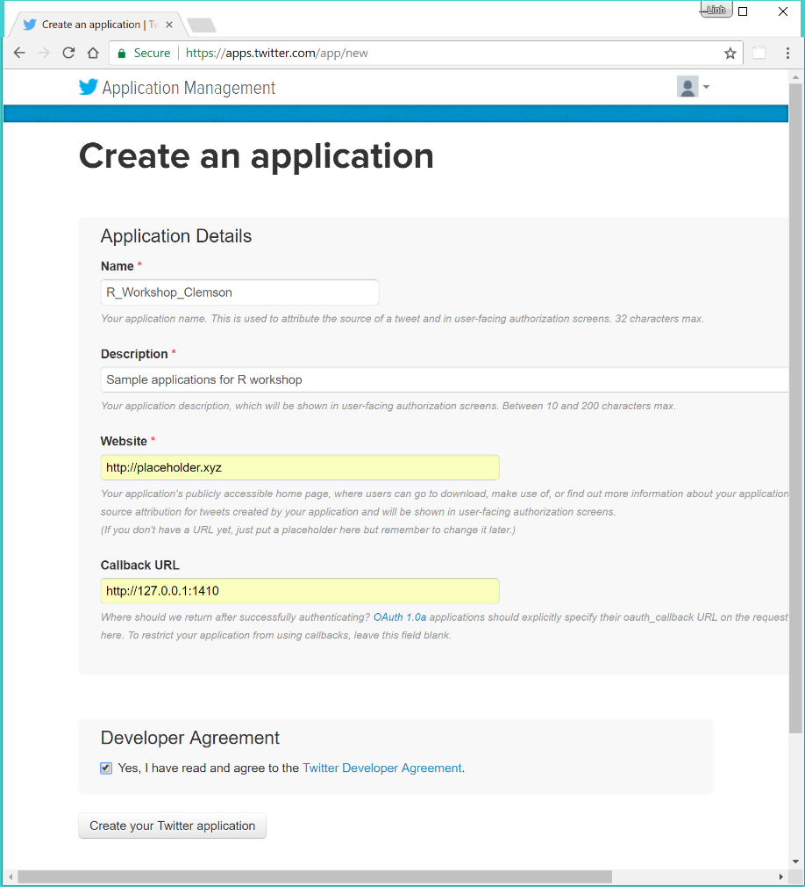

## 1. Installing packages: `feedeR`, `rtweet`, `RCurl`, `xml2`, `RJSONIO`, `RSQLite`, `stringr`

**1.1 Establish an SSH connection with X11 tunnel to `user.palmetto.clemson.edu`: **

- For Linux machines, you can use the default command line terminal
- For Mac machines, you need to make sure that XQuartz is installed before using the default command line terminal
- For Windows machines, the recommended approach is to download and install [MobaXterm](http://mobaxterm.mobatek.net/)

Additional documentations can be found at:

- [Logging on to Palmetto using MobaXterm for Windows](https://www.palmetto.clemson.edu/palmetto/userguide_basic_usage.html)
- [How to run graphical appliction](https://www.palmetto.clemson.edu/palmetto/userguide_howto_run_graphical_applications.html)

**1.2. Request a temporary node with X11 tunnel for setting the required R packages **

Once you are logged into palmetto, prior to getting a new node, you need to have an environmental variable set up to run at start. This is done via the following command:

```
echo 'export CONDA_ENVS_PATH=/usr/local/share/jupyterhub/env' >> .bashrc
```

Next, request a node for two hours:

```
clear
qsub -I -X -l walltime=02:00:00
```

**1.3. Open the correct R distribution that is used for JupyterHub's R notebooks **

```
module load anaconda3/4.2.0
source activate R
R
```

**1.4. Install packages:**

Inside the R prompt, run the following command

```
package_list <- c('feedeR','rtweet','RCurl','xml2','RJSONIO','RSQLite','stringr')
install.packages(package_list,repos='http://cran.cnr.berkeley.edu/')
```

- If this is the first time that you run R from inside Palmetto, R will ask for a non-root installation directory for future packages. Accept the suggested path that looks similar to the following: ‘/home/YOUR_USER_NAME/R/x86_64-pc-linux-gnu-library/3.3’
- If for some reasons the Berkely mirror URL does not work, you can also try using the folowing URLS for repos:
  - http://cran.stat.ucla.edu/
  - http://mirror.las.iastate.edu/CRAN/
  - http://cran.mtu.edu/ 
- Other mirror URLs can be found at https://cran.r-project.org/mirrors.html
- You can test that all packages are installed and usable by load them all and check session information to see the loaded packages under header *other attached packages*

```
library(feedeR)
library(rtweet)
library(RCurl)
library(xml2)
library(RJSONIO)
library(RSQLite)
library(stringr)
sessionInfo()
```


## 2. Setup `rtweet` for streaming Twitter data

- This section is based on instructions provided at https://mkearney.github.io/rtweet/articles/auth.html
- The terminal connecting to Palmetto with X11 tunneling from step 1 should be kept open.

** 2.1. Creating Twitter account **

- Sign up for a Twitter account at https://twitter.com
- Make sure that your account has an associated phone number. This is required to make your Twitter account into a developer account (being able to create app)

** 2.2. Creating Twitter app **

- Go to https://apps.twitter.com and sign in with your Twitter account
- Create an application:
  - Application names are unique, you will need to pick a different name from R_Workshop_Clemson
  - Some descriptions are required, it is just to describe what your application will do
  - The website is required, but you do not have to provide a specific website. You only need to provide a place holder URL that is in the correct format. 
  - The Callback URL must be http://127.0.0.1:1410
- Once the Twitter app is created, you will be able to click on the app's name on the front page of https://apps.twitter.com to go to the Application Management page. Select the **Keys and Access Tokens** tab to see your access tokens. You will need the **Consumer Key (API Key)** and **Consumer Secret (API Secret)** strings as shown in this tab for the next steps. 



** 2.3. Setting up Twitter security token for R's rtweet package: **

- Continue in the same command line terminal from step 1, type in the following R codes

```
appname <- YOUR_APP_NAME
key <- YOUR_CONSUMER_KEY
secret <- YOUR_CONSUMER_SECRET
twitter_token <- create_token(app = appname,consumer_key = key,consumer_secret = secret)
```

- After these R commands are executed, a Firefox browser will pop up asking you to sign in and authenticate the access token, and the R environment will print the following lines while waiting for the authentication:

```
Waiting for authentication in browser...
Press Esc/Ctrl + C to abort
```

- Click on the blue **Authorize App** button to confirm the authorization. This will take you to a web page that has the lines *Authentication complete. Please close this page and return to R*. You can now close the Firefox browser. The R environment will print out the line *Authentication complete* and escape from waiting mode into the normal R prompt. 


** 2.4. Saving Twitter security token for future usage: **

The `twitter_token` variable should be saved to a file after step 2.3 is completed so that it can be reused later. The process is as follows:

- Continuing in the same R command line terminal as step 2.3, execute the followings:

```
home_directory <- path.expand("~/")
file_name <- file.path(home_directory, "twitter_token.rds")
saveRDS(twitter_token, file = file_name)
cat(paste0("TWITTER_PAT=", file_name),file = file.path(home_directory, ".Renviron"),append = TRUE)
```

- The above codes will save the `twitter_toke` variable into the `twitter_token.rds` file stored inside your home directory. Next, it creates an environment variable called `TWITTER_PAT` that points to this file and store the environment variable in the default `.Renviron` file that will be loaded by R whenever R is started. 
- It is possible to customize the path to the token file (maybe save it to a specific directory) and `TWITTER_PAT`
- When tne `rtweet` library is loaded, `TWITTER_PAT` will be read and all subsequent streaming calls to Twitter will be validated automatically. 
